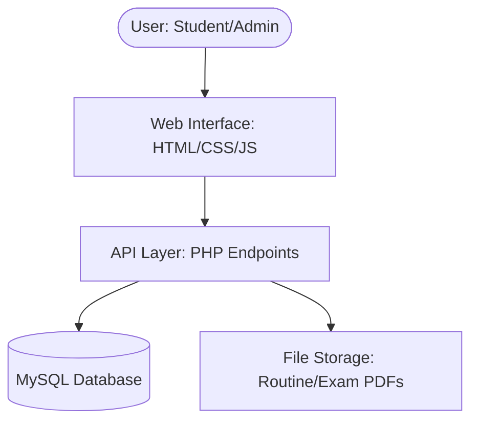

# 🎓 ICC Companion - Comprehensive Project Documentation

## 📋 Table of Contents
1. [Project Overview](#-project-overview)
2. [Tech Stack](#-tech-stack)
3. [Key Features](#-key-features)
4. [Database Schema (MySQL)](#-database-schema-mysql)
5. [System Architecture](#-system-architecture)
6. [Development Roadmap](#-development-roadmap)

---

## 🎯 Project Overview

**ICC Companion** (Icon Commerce College Campus Portal) is a professional web-based management system designed to digitize and simplify campus life for both students and staff.

- **Tagline**: "Your all-in-one college management solution"
- **Primary Goal**: To provide real-time access to academic data, attendance, and campus-wide communications.

---

## 🛠️ Tech Stack

The project utilizes a proven and reliable **LAMP-equivalent** architecture (optimized for XAMPP):

- **Frontend**: 
  - **HTML5 & CSS3**: Semantic structure and modern responsive design.
  - **Vanilla JavaScript**: Dynamic DOM manipulation and asynchronous API handling.
- **Backend**:
  - **PHP**: Server-side logic for data processing and API endpoints.
- **Database**:
  - **MySQL**: Relational data storage for students, attendance, schedules, and more.
- **Server Environment**: 
  - **Apache**: Web server via XAMPP.
- **Data Exchange**:
  - **JSON**: Standardized format for communication between the frontend and PHP backend.

---

## 🚀 Key Features

### 👨‍🎓 Student Dashboard
Designed for accessibility and clarity, the student panel provides:
- **Attendance Tracker**: Visual progress bars and automatic calculations of attendance eligibility (e.g., "Classes you can miss" or "Classes needed").
- **Exam Timetable**: Real-time schedules for Sessional and Final exams with countdown timers.
- **Announcements**: A centralized feed for college notices, events, and holidays.
- **Lost & Found Portal**: Browse items lost or found on campus, with the ability to report new lost items.
- **Academic Resources**: Access to digital class routines and exam schedules in PDF/Image formats.

### 👩‍💼 Admin Management Panel
A powerful control center for college staff:
- **Student Information System (SIS)**: Full CRUD (Create, Read, Update, Delete) operations for student profiles.
- **Smart Attendance Marker**: A quick, checkbox-based interface for marking daily attendance for entire classes.
- **Exam Controller**: Manage the academic calendar by scheduling exams across different departments and semesters.
- **Global Communications**: Post, edit, and delete announcements targeted at specific departments or semesters.
- **Lost & Found Manager**: Review reported items, manage listings, and mark items as "Claimed".
- **Dynamic File Manager**: Upload and update class routines and exam schedules.

---

## 💾 Database Schema (MySQL)

The system manages data through a highly structured relational database named `campus_portal`.

### Core Tables & Relationships

| Table Name | Description | Key Fields |
|:---|:---|:---|
| **`departments`** | List of academic divisions. | `dept_id`, `dept_code` (Unique), `dept_name` |
| **`subjects`** | Courses offered per department/semester. | `subject_id`, `subject_code`, `dept_code` (FK) |
| **`students`** | Student profiles and login credentials. | `student_id`, `roll_number` (Login), `dob` (Pass), `dept_code` (FK) |
| **`admins`** | Staff and Administrator accounts. | `admin_id`, `username`, `password`, `role` |
| **`attendance`** | Daily class attendance records. | `attendance_id`, `roll_number` (FK), `subject_id` (FK), `status` |
| **`exams`** | Individual exam schedules. | `exam_id`, `subject_id` (FK), `exam_date`, `exam_type` |
| **`lost_found`** | Campus lost and found inventory. | `item_id`, `title`, `item_type` (Lost/Found), `status` |
| **`announcements`** | System-wide notices and alerts. | `announcement_id`, `title`, `priority` (High/Med/Low) |
| **`class_routines`** | Document paths for weekly schedules. | `routine_id`, `dept_code` (FK), `file_url` |

> [!NOTE]
> All tables include timestamp tracking (`created_at`) for auditing and historical data management.

---

## 🏗️ System Architecture

1. **Authentication**: Students login via Roll No. and DOB. Admins use staff credentials.
2. **Session Persistence**: PHP sessions manage user state securely.
3. **Responsive Display**: Mobile-first design ensures accessibility on smartphones and tablets.

---

## 📅 Development Roadmap

The project followed a structured 30-day development cycle:
1. **Week 1 (Foundation)**: Core architecture, Database setup, and Authentication.
2. **Week 2 (Student Experience)**: Implementation of Attendance, Timetable, and Lost & Found modules.
3. **Week 3 (Admin Control)**: Development of management tools for students, attendance, and exams.
1. **Week 4 (Polish & Deployment)**: Announcement system, UI/UX refinements, and final verification.

---

## 🛠️ Technical Depth (Self-Study for Viva)

To explain this project properly during your presentation, focus on these three professional-grade implementations:

### 1. Database Transactions (`ACID` Properties)
In the attendance system (`save-attendance.php`), we use **Transactions**. 
- **Concept**: Atomic operations. Either all attendance records are saved, or none are.
- **Why**: Prevents a situation where half the class is marked present but a database error stops the rest, leaving the data in a "half-saved" state.

### 2. SQL Injection Prevention (Prepared Statements)
All user-provided data is handled via **Prepared Statements** (`mysqli_prepare`).
- **Concept**: Separation of SQL logic from User Data.
- **Why**: This is the industry standard for security. It ensures that a malicious user cannot enter "Roll Number: `1; DROP TABLE students;`" and delete your data.

### 3. Asynchronous Data Handling (Fetch API & JSON)
The system uses the **AJAX** model via the modern JavaScript **Fetch API**.
- **Concept**: Asynchronous communication.
- **Why**: Traditional PHP websites refresh the whole page for every click. This project updates only the necessary data blocks (JSON), making it feel like a modern "Single Page Application" (SPA) while still using fundamentally solid PHP.
